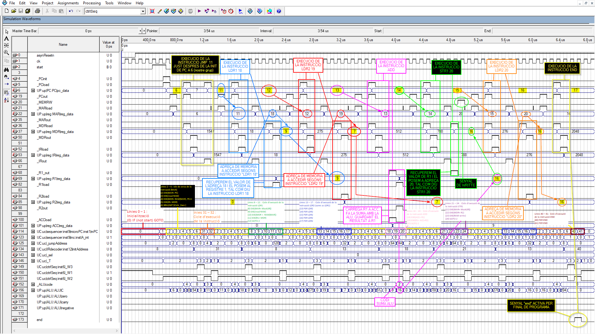

# LittleProc CPU Implementation

A full CPU implementation based on the LittleProc architecture, developed as a class project using Quartus.

*Simulation waveform showing the CPU execution.*

## Schematics

- [Top Level Architecture (LittleProc)](littleProc.pdf)
- [Processing Unit (UP)](UP.pdf)
- [Control Unit (UC)](UC.pdf)

## Structure

- `Projecte/`: Contains the VHDL/Schematic source files and Quartus project.
- `*.pdf`: Schematics.

## Usage

This project was built using **Quartus II 9.0sp2 Web Edition**. Open the `Projecte/LittleProc.qpf` to load the project.
